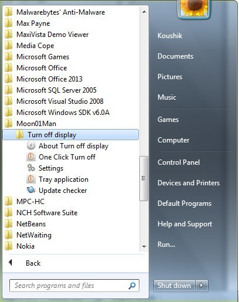
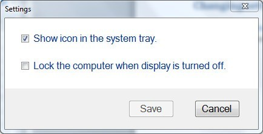
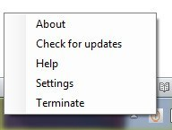

# Turnoff display (ToD)

## What is Turnoff Display

A simple, light weight, easy to use power management applet that switches off your computer's display screen. with just a single click, it's the quickest way to turn off the display.

Primarily developed for laptops, this applet can be used to turn the monitor off on any computer running on Windows 7, 8, 8.1 & 10.

When your computer is not actively in use but is performing background tasks, shut off the monitor to conserve energy. Go green with turn off display.

  

## Screenshots

1.   Program directory

2.   Settings

3.   Tray menu

## Recommended requirements

1. dotNET framework 3.0
2. Windows 7 or above
3. 30 MiB disk space

## Installation instructions

1. [Download](#download-mirrors) the setup file.
2. Run the installer.
3. Follow the instructions in the installation wizard to install Turn off display.
4. After installation click finish to complete the installation process.

## Download Mirrors

Source forge

CNET

Software Informer

